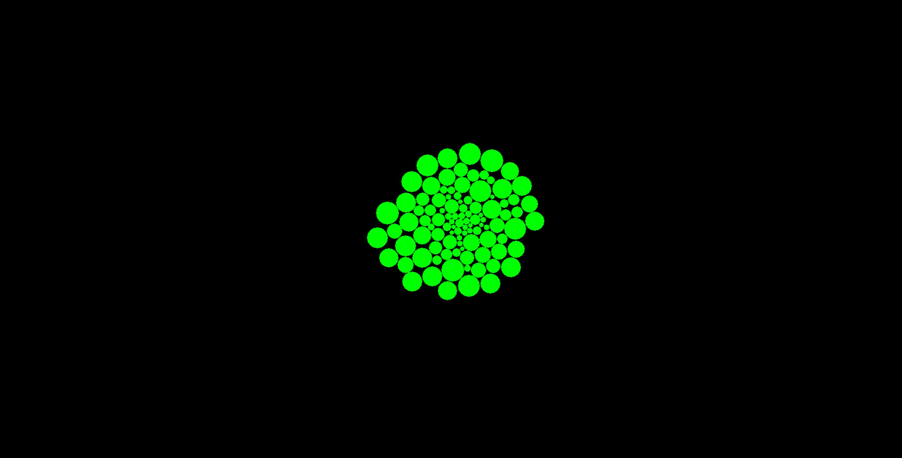

# particle_collisions
Pretty much exactly realistic particle collision simulator (except for floating point inaccuracies).

I will admit that the code isn't exactly pristine. It's very much still in development, but even in it's current state, the algorithm is pretty interesting.

# Basic Description of Algorithm
We put realism on the highest spot possible in the list of priorities in this project. This comes at the expense of speed.

The source of the realism comes from the fact that there exists a closed-form solution to the problem of where two particles (each posessing a position and a velocity vector) will meet. We calculate this meeting point for every pair of particles (because the order of the particles in a pair is irrelevant, this has a much better time complexity than O(n^2), so that's nice).

We take the meeting point that happens first in the set of all prospective meeting points and simulate everything up until that meeting point. Afterwards, we reflect the pair of particles that are doing the meeting.

Then we do the whole thing over again, as in find the closest meeting point, simulate up to it, etc...

IMPORTANT: As stated above, that's just a basic description of the algorithm. Special care is taken to make sure the particles travel the entirety of their velocity step in each frame (which is easier said than done in the context of the above algorithm). We also have some interesting behavior for when two particles end up inside of each other (which should never actually happen without god-like interference from the user). Also, the particles have to bounce off of walls. There are a bunch of other small things to consider as well.

NOTE: I realize that something like Verlet integration is much better suited to most applications, but I still think this project is cool. The main thing that makes it interesting for me is that Verlet integration approaches realism with smaller and smaller values for delta-t, but this project is absolutely realistic from the start, which is something Verlet integration can never hope to accomplish. This perspective of course ignores floating point inaccuracies, but those are in a league of their own and affect every physics simulation, no matter how realistic, so my point still stands.

# How To Build
It's a Visual Studio solution, so just clone the repo (recursively, there are submodules) and open it up in Visual Studio.

As I've said above, it's still very much in development, so it's really only meant to be run in Debug mode with the debugger attached.

I recommend using x64 mode, because the simulation runs significantly faster than with x86 mode, at least on my machine.

# Demo Images

